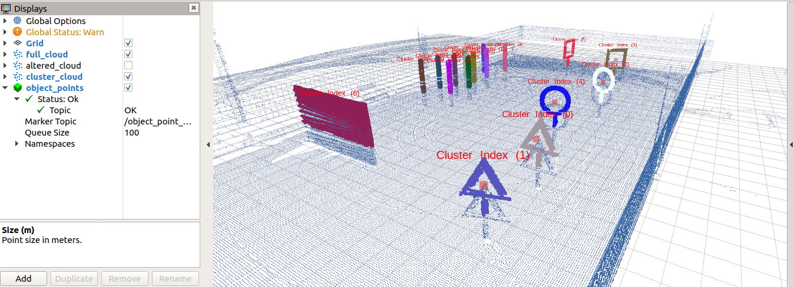
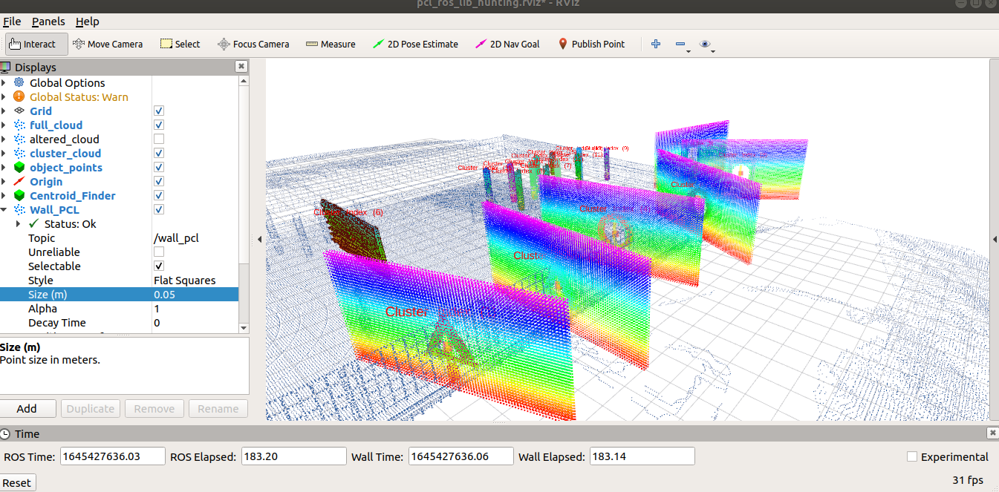
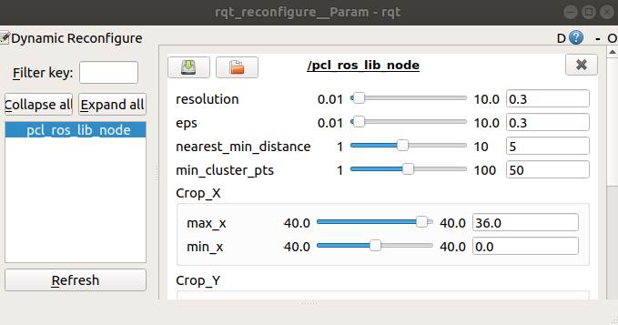

# PCL_ROS_LIBRARY

Pointlcloud library and ros integration for pointcloud manipulation, including **crop**, **transform**, **filter** and **clustering**. From clustering the algorithm allocate **IDs** according to their cluster index. This will help users to further do isolated manipulation according to the relevant IDs. Also added a **rviz** visualization node for quick debugging.

Added `Gap Recognition` so that a hard "wall" can be made to constrain and remove free points around the gap.

**Updates**
- Crashes do happen when using dynamic_reconfigure and I have removed rotation so please set it in the `pcl_ros_lib.yaml` first before running
- Do save your dynamic reconfigure setting occasionally while the program is running to prevent lost of data in crashes

| Normal | With Gap Recognition |
| --- | ---|
| |  |

**To launch this package simply**
```bash
roslaunch pcl_ros_lib sample.launch
# Launch RVIZ 
roslaunch pcl_ros_lib sample_rviz.launch
```
**Added RQT dynamic_reconfigure**

```bash
# Launch dynamic reconfigure 
rosrun rqt_reconfigure rqt_reconfigure
```

**To Setup**
```bash
sudo apt-get install -y ros-melodic-tf2-ros ros-melodic-tf2-sensor-msgs ros-melodic-tf2-geometry-msgs
# Add to your workspace/src
catkin build pcl_ros_lib -j1
```

You can refer to http://wiki.ros.org/pcl_ros if you need any clarifications for the next step
- To save the `.pcd` file, you can do this for `/altered_pcl` topic
```bash
# altered_pcl is the published message PointCloud2
# To save into your home environment
rosrun pcl_ros pointcloud_to_pcd input:=/altered_pcl _prefix:=/home/<user>/<arbitrary prefix>_
```

- To double check whether it is saved correctly, publish pcd to pointcloud
```bash
cd 
rosrun pcl_ros pcd_to_pointcloud <pcl_file_name>.pcd 0.1 _frame_id:=/map
```

Parameters are found in `config/pcl_ros_lib.yaml` with some crucial values being displayed below, `Transform Parameters` parses the values into a `TransformStamped` message, while `Crop Parameters` parses the values into a PCL box crop 

Test parameters for `dynamic reconfigure` are found in `config/test_parameters_reconfigure.yaml`
```yaml
# Transform Parameters
translate_x: 0.0 # Translate in x axis of the map in NWU
translate_y: 0.0 # Translate in y axis of the map in NWU
translate_z: 1.0 # Translate in z axis of the map in NWU
rotate_roll: 0.0 # Rotate in x axis of the map in NWU
rotate_pitch: 0.0 # Rotate in y axis of the map in NWU
rotate_yaw: 0.0 # Rotate in z axis of the map in NWU

# DBSCAN Parameters
resolution: 0.3 # Resolution of the cluster
nearest_min_distance: 5 # Minimum distance between each of them
min_cluster_pts: 50 # How many points is considered as a cluster
eps: 0.3 # The radius for searching neighbor points of octree

# Crop Parameters
max_x: 19.7 # Max limit of the crop in x axis in NWU
max_y: 9.7 # Max limit of the crop in y axis in NWU
max_z: 6.0 # Max limit of the crop in z axis in NWU

min_x: -19.7 # Min limit of the crop in x axis in NWU
min_y: -9.7 # Min limit of the crop in y axis in NWU
min_z: 0.15 # Min limit of the crop in z axis in NWU

# Run Parameters
spin_once: false
ros_rate: 0.3
```

### References
1. **DBSCAN** : https://github.com/LingyuDu/dbscan/blob/master/dbscan.cpp
